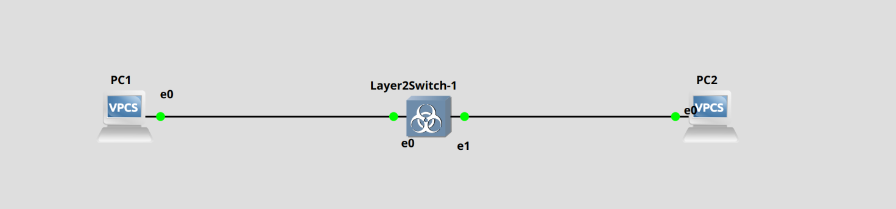
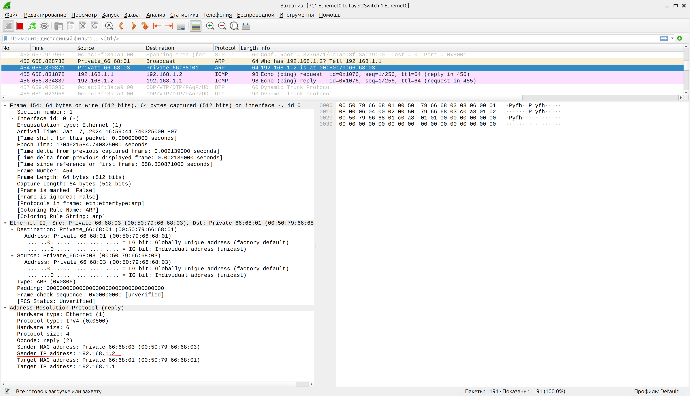

# Лабораторная работа №1

## Тема: Освоение инструментария для выполнения работ, построение простой сети

1) Установить и настроить эмулятор GNS3

2) Создать простейшую сеть, состоящую из 1 коммутатора и 2 компьютеров, назначить им произвольные ip адреса из одной сети

3) Запустить симуляцию, выполнить команду ping с одного из компьютеров, изпользуя ip адрес второго компьютера

4) Перехватить трафик протокола arp на всех линках и проанализировать заголовки пакетов в программе Wireshark, для фильтрации трафика, относящегося к указанному протоколу использовать фильтры Wireshark

ARP-запрос

ARP-ответ

5) Создать простейшую сеть, состоящую из 1 маршрутизатора и 2 компьютеров, назначить им произвольные ip адреса из разных сетей

6) Запустить симуляцию, выполнить команду ping с одного из компьютеров, изпользуя ip адрес второго компьютера

7) Перехватить трафик протокола arp и icmp на всех линках, проанализировать заголовки пакетов в программе Wireshark, для фильтрации трафика, относящегося к указанному протоколу использовать фильтры Wireshark

PC3->R1 (ARP)

R1->PC4 (ARP)

ICMP

