# Лабораторная работа №2

## Тема: Настройка протокола STP (IEEE 802.1D)

1) Для заданной на схеме schema-lab2 сети, состоящей из управляемых коммутаторов и персональных компьютеров настроить протокол STP

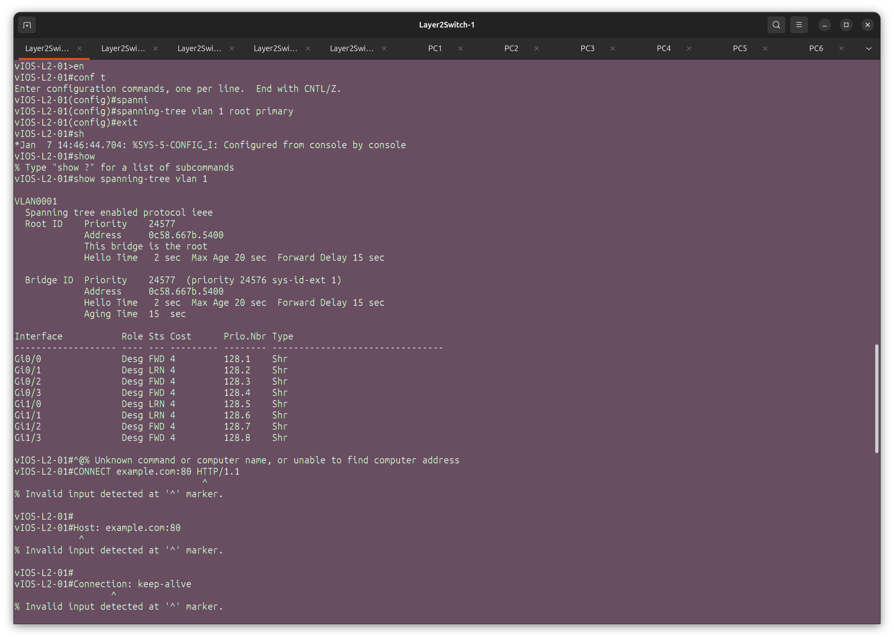

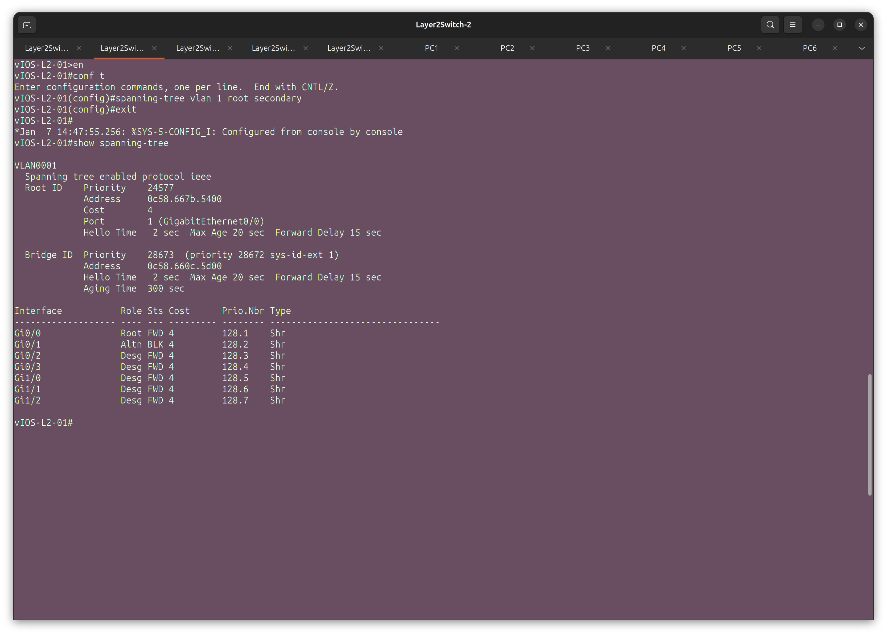

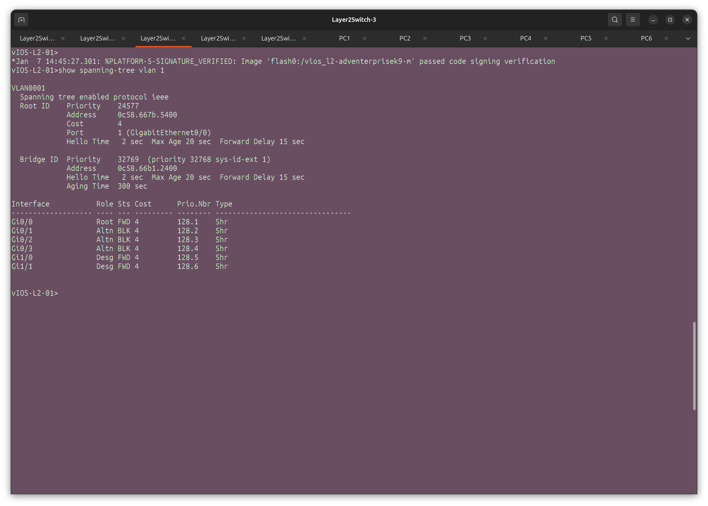

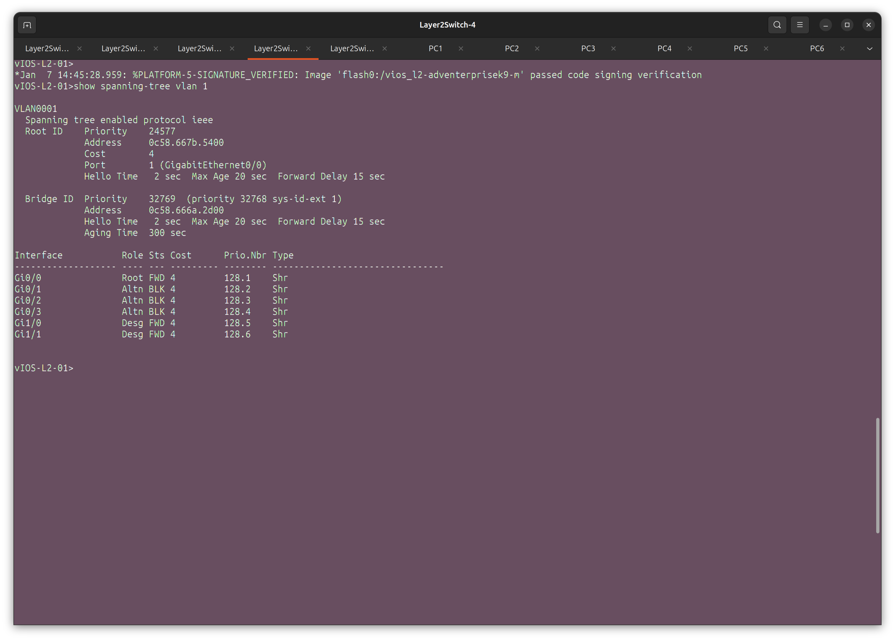

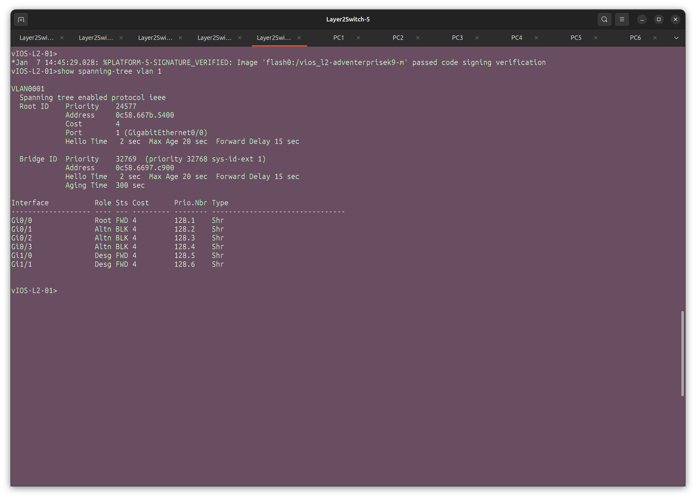

2) Проверить доступность каждого с каждым всех персональных компьютеров (VPCS), результаты запротоколировать

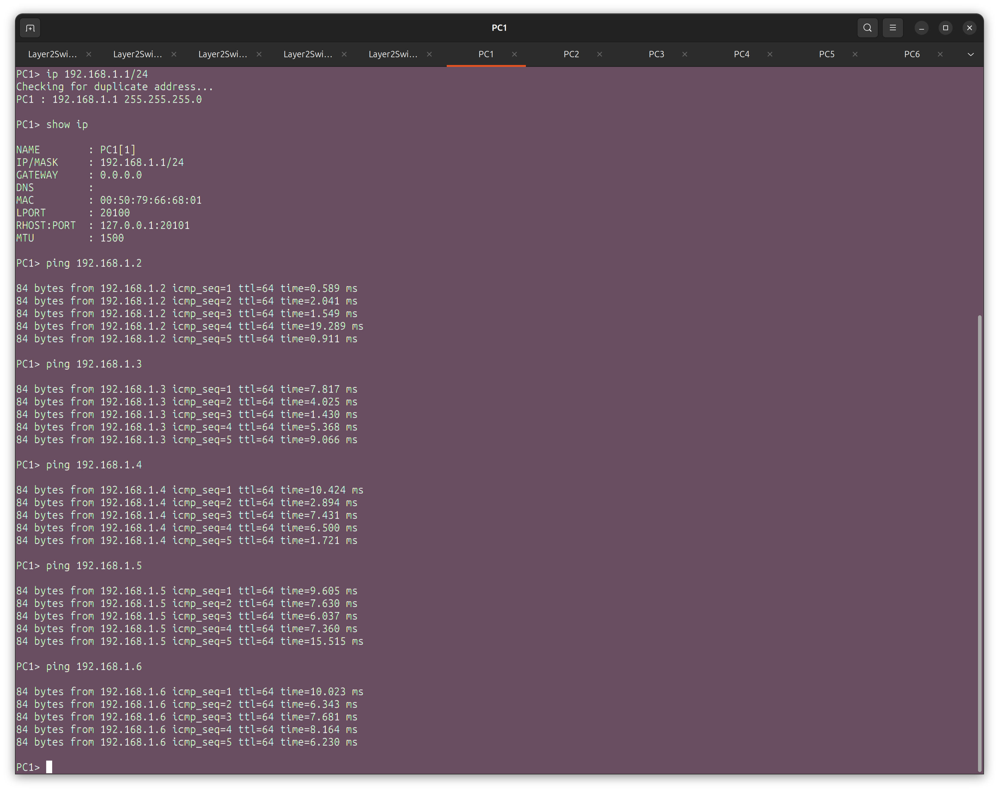

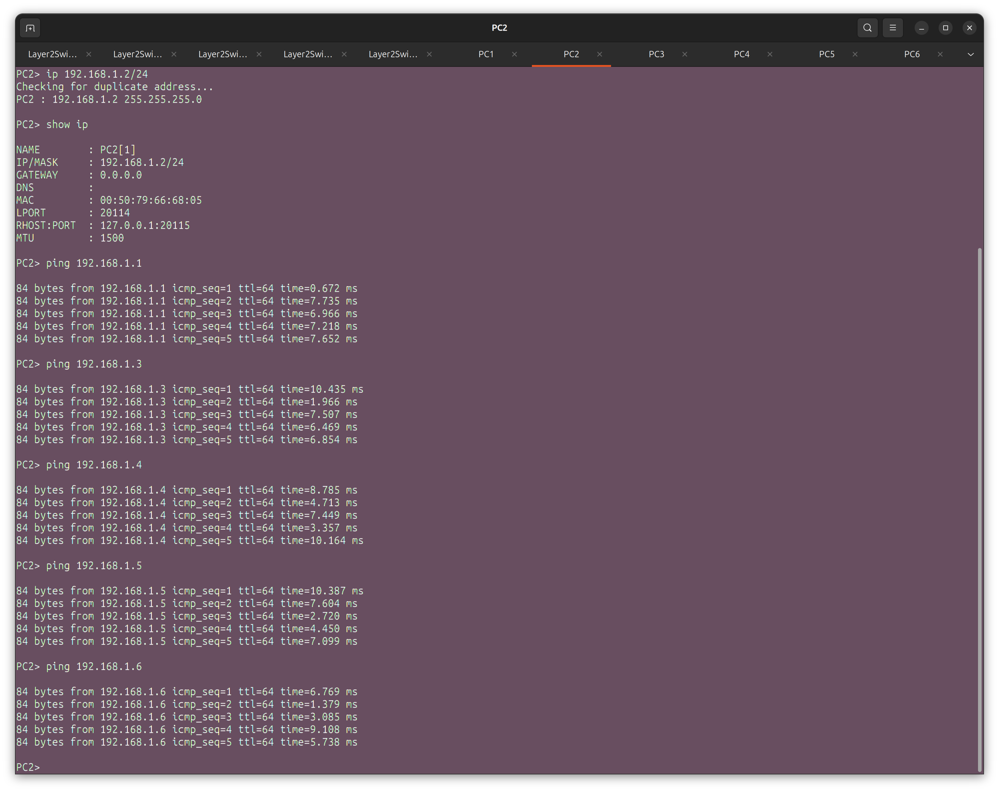

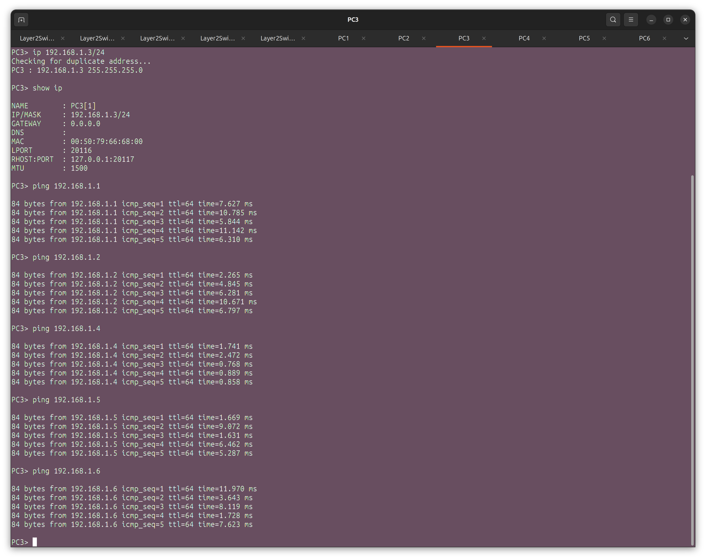

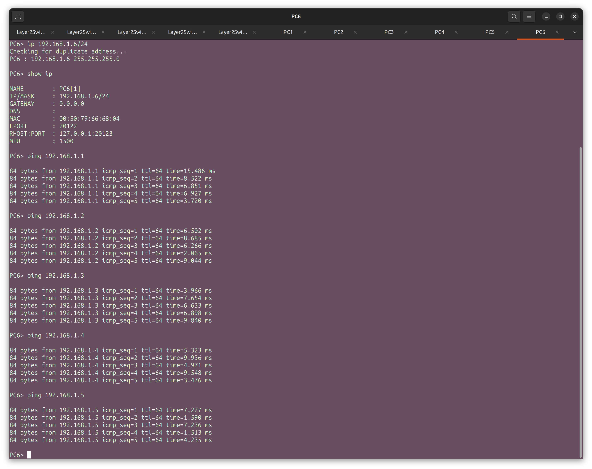

3) На изображении схемы отметить BID каждого коммутатора и режимы работы портов (RP/DP/blocked) и стоимости маршрутов, результат сохранить в файл

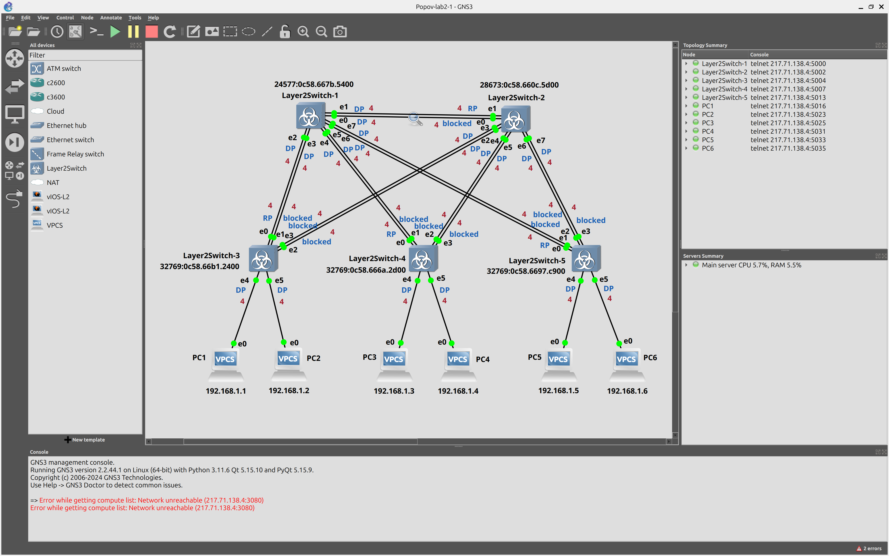

4) При помощи wireshark отследить передачу пакетов hello от корневого коммутатора, результаты включить в отчет

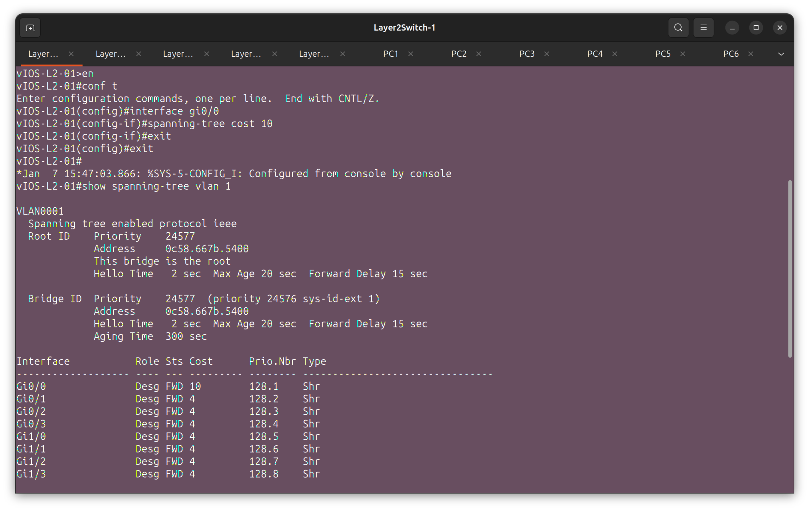

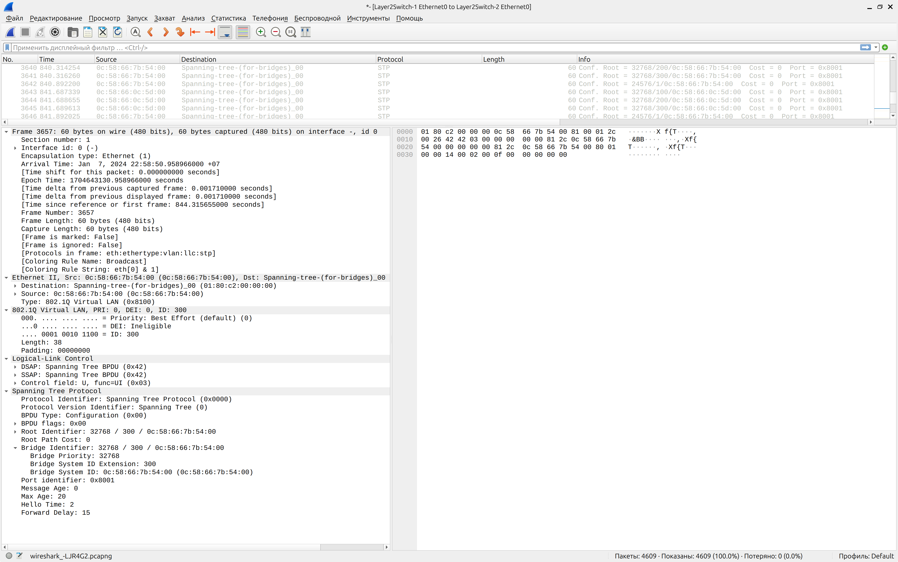

5) Изменить стоимость маршрута для порта RP произвольного назначенного (designated) коммутатора, повторить действия из п.3, результат сохранить в отдельный файл

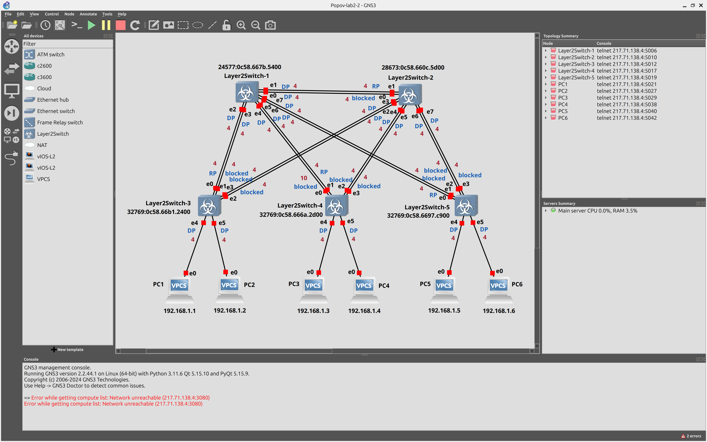

6) Сохранить файлы конфигураций устройств в виде набора файлов с именами, соответствующими именам устройств

7) (*) Опциональное задание: заменить STP на RSTP (IEEE 802.1w), повторить 1-6, отметить резервные порты в п.3 и п.5, отличие работы протокола RSTP от протокола STP в п.4

Полезная информация: схема сохранена на сервере в проекте под именем Menzhulin-lab2-template, можно использовать кнопку Duplicate