# Лабораторная работа №3

## Тема: Настройка агрегирования каналов

1) Для заданной на схеме schema-lab3 сети, состоящей из управляемых коммутаторов и персональных компьютеров настроить на коммутаторах протокол LACP агрегирования каналов технологии EtherChannel

Четыре возможных случаев агрекации каналов EtherChannel

| SW-1    | SW-2    | Link |
| :------ | :------ | :--- |
| ACTIVE  | ACTIVE  | YES  |
| ACTIVE  | PASSIVE | YES  |
| PASSIVE | ACTIVE  | YES  |
| PASSIVE | PASSIVE | NO   |

2) Изменяя режим работы групп портов в режиме агрегирования произвольных соседних коммутаторов проверить работоспособность режима агрегации

Проверим произвольно режим агрегации следующим образом:

- ACTIVE - ACTIVE : SW-1 - SW-3

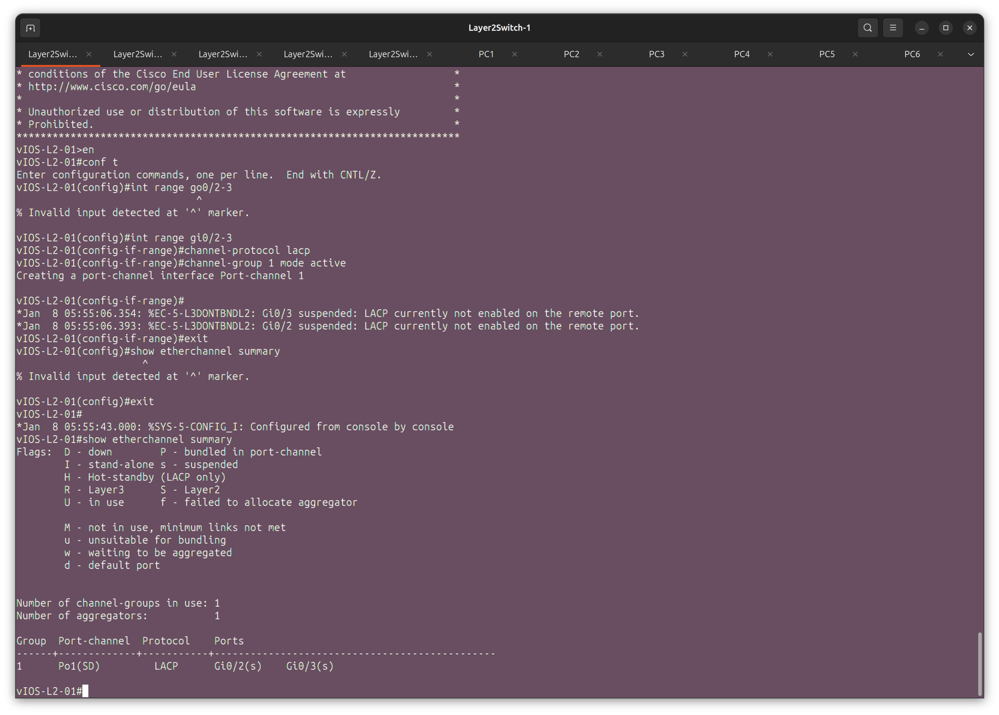

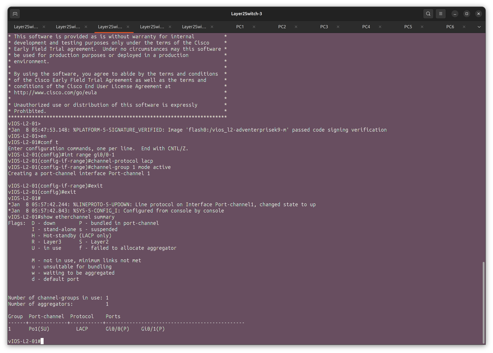

- ACTIVE - PASSIVE : SW-1 - SW-4

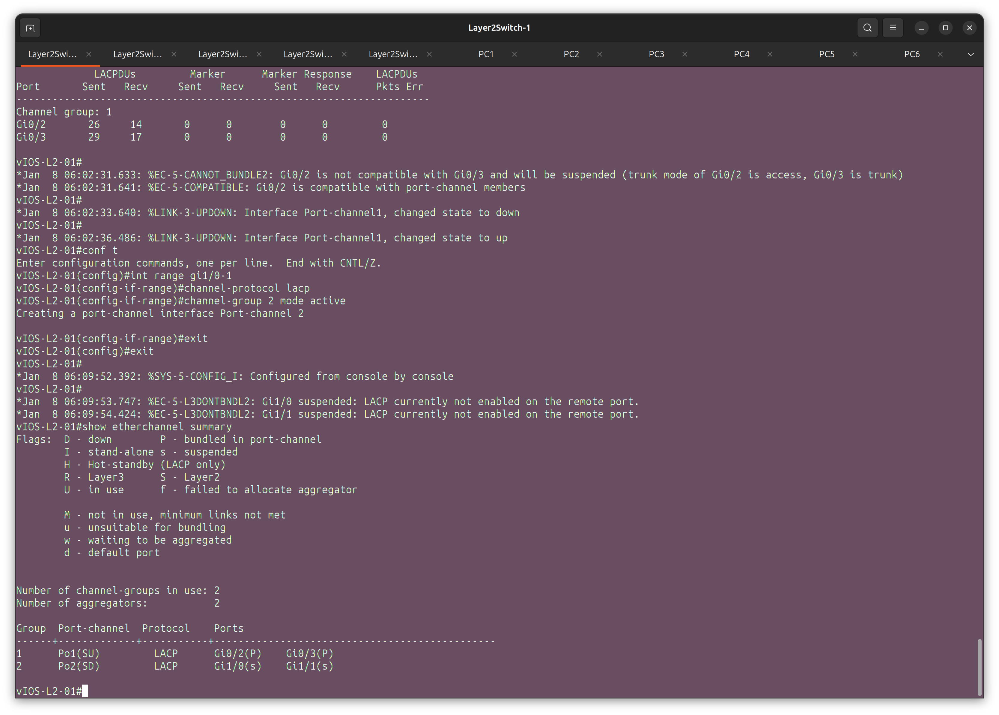

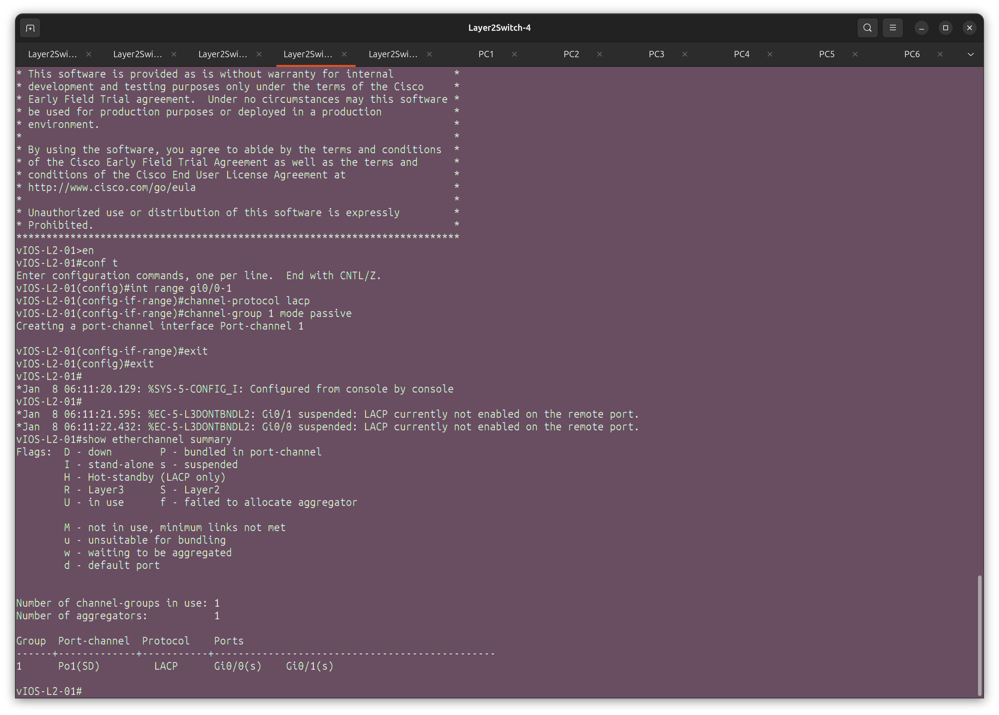

- PASSIVE - ACTIVE : SW-1 - SW-5

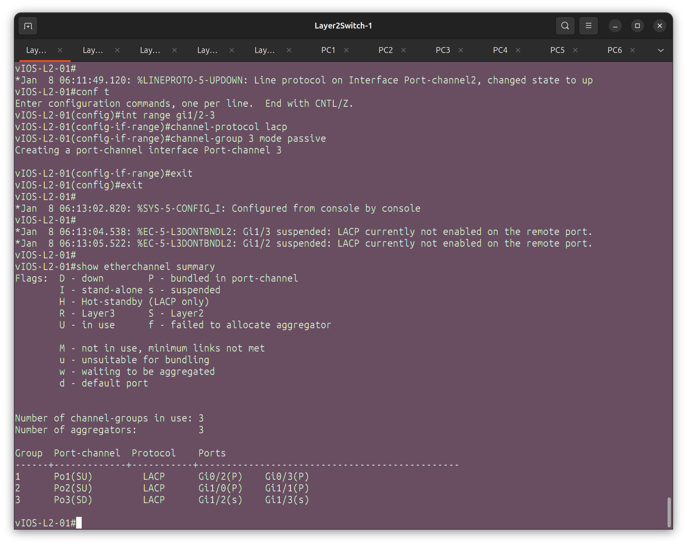

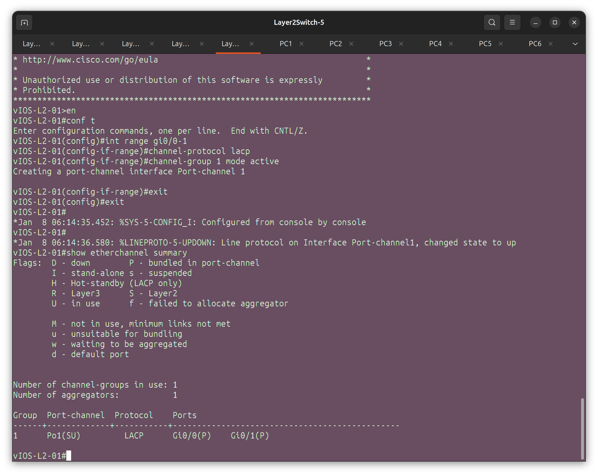

- PASSIVE - PASSIVE : SW-2 - SW-3

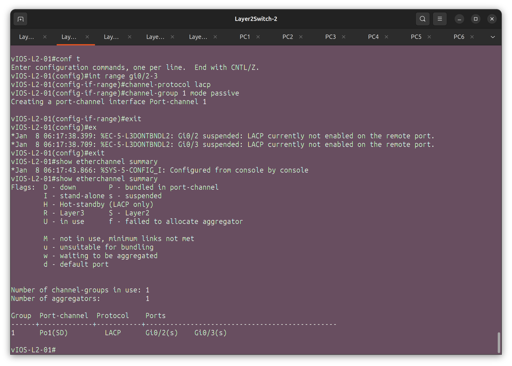

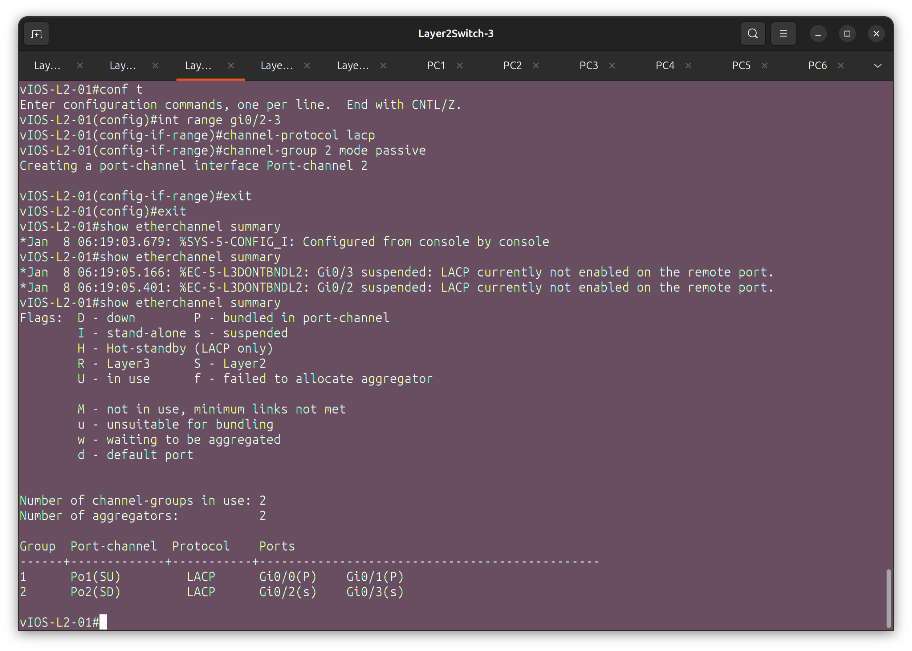

3) Получить статистику пакетов для портов коммутаторов, результаты сохранить в файл, cоздать некоторый трафик между различными персональными компьютерами, сохранить новую статистику (рекомендуется использовать таблицы excel или его opensource аналоги для наглядности)

SW-1 (до и после трафика):

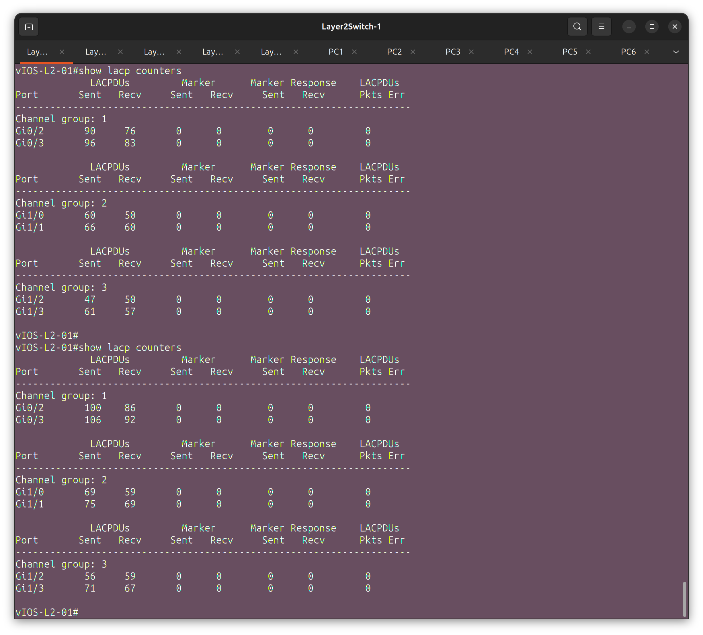

SW-3 (до и после трафика):

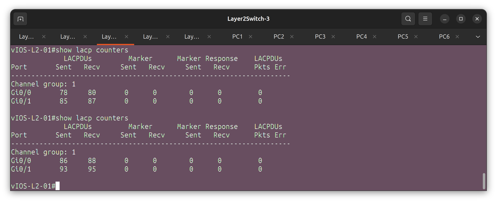

SW-4 (до и после трафика):

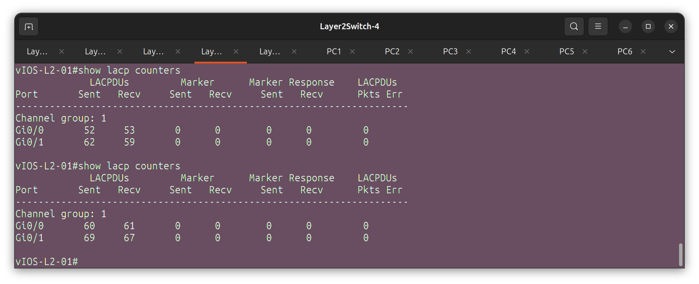

SW-5 (до и после трафика):

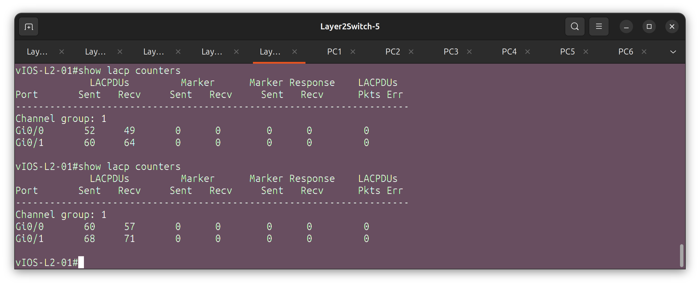

4) Сохранить файлы конфигураций устройств в виде набора файлов с именами, соответствующими именам устройств

5) (*) Опциональное задание: Повторить пункты 1-4 используя протокол PAgP

Полезная информация: вам все еще нужен STP