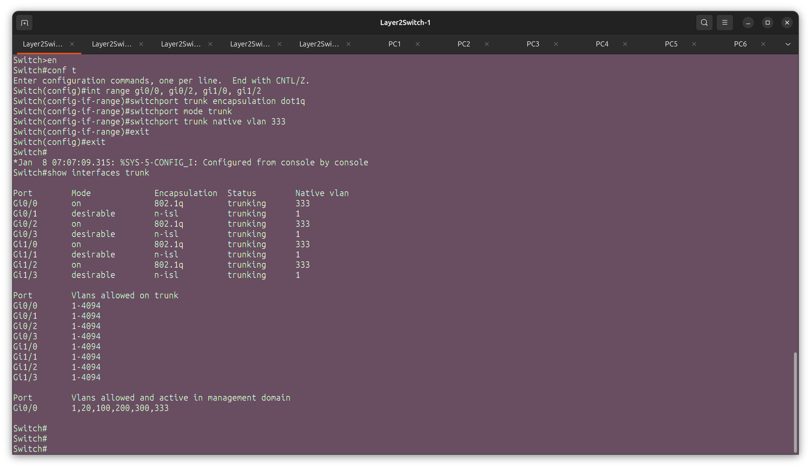
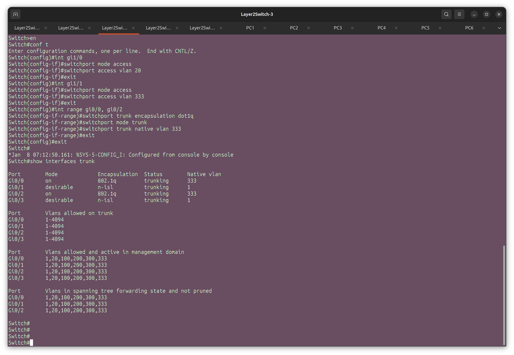
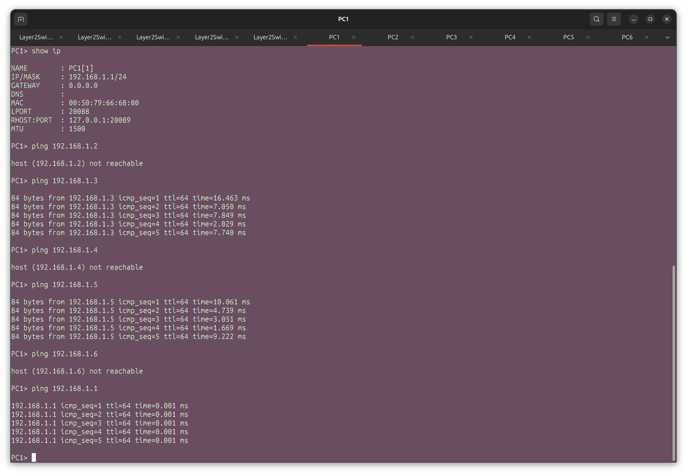

# Лабораторная работа №4

Тема: Настройка виртуальной локальной сети (VLAN)

1) Для заданной на схеме schema-lab4 сети, состоящей из управляемых коммутаторов и персональных компьютеров настроить на коммутаторах логическую топологию используя протокол IEEE 802.1Q, для передачи пакетов VLAN333 между коммутаторами использовать Native VLAN

Настройка trunk портов (SW-1, SW-2):

Настройка access портов (SW-3, SW-4, SW-5):

2) Проверить доступность персональных компьютеров, находящихся в одинаковых VLAN и недоступность находящихся в различных, результаты запротоколировать

VLAN20: PC1, PC3, PC5 (доступны из PC1)

VLAN333: PC2, PC4, PC6 (недоступны из PC1)

3) Сохранить файлы конфигураций устройств в виде набора файлов с именами, соответствующими именам устройств

4) (*) Опциональное задание: Добавить в схему маршрутизатор, подключенный к коммутаторам Layer2Switch1 и Layer2Switch2, настроить через него маршрутизацию между VLAN

Полезная информация: избыточные физические каналы можно поместить в отдельные VLAN и обойтись без STP